# Gates of the Bosphorus (Victoria 3 Mod)

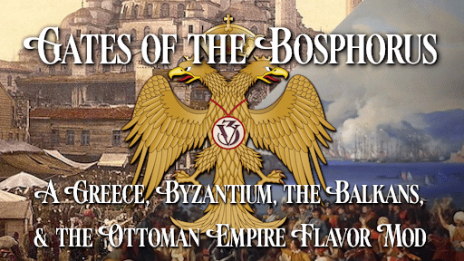

### IMPORTANT: This mod is dependent on the Community Mod Framework to work correctly! 
**Community Mod Framework**: https://steamcommunity.com/sharedfiles/filedetails/?id=3385002128

*"One day the great European War will come out of some damned foolish thing in the Balkans" —Otto von Bismark, 1888*

Ever noticed that despite being called "the powder keg of Europe", nothing really happens in the Balkans most games? Or that instead of a powder keg you only get a sad Ottoman basket case?

That's what lead led me to create Gates of the Bosphorus. This mod aims to add historical context and new mechanics to nations of the Balkans and the Ottoman Empire. This mod has an expensive scope covering the Ottoman and post-Ottoman states of the near East with an eventual goal of providing content from 1836 into the 1940s.

*NOTE: This mod will not provide any DLC-exclusive content unless you own the respective DLC!*

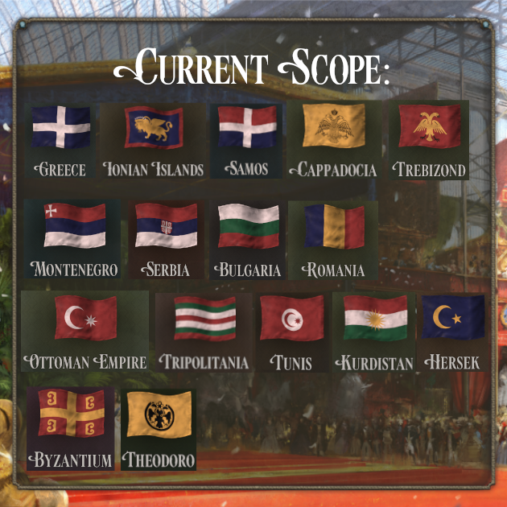
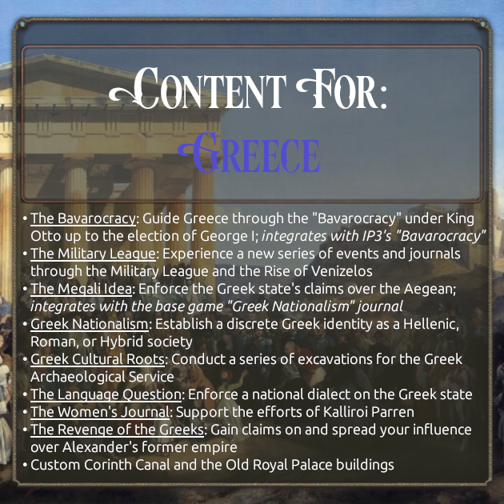
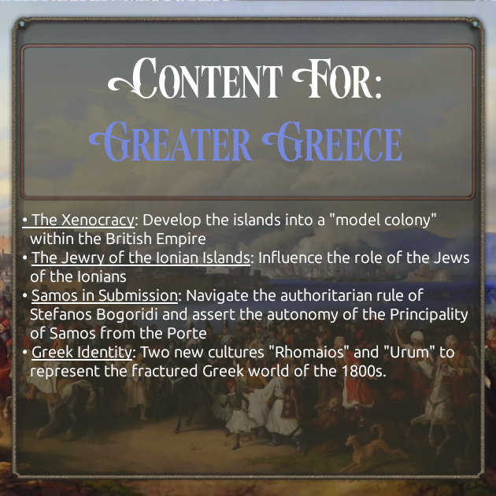
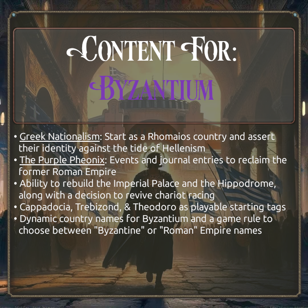
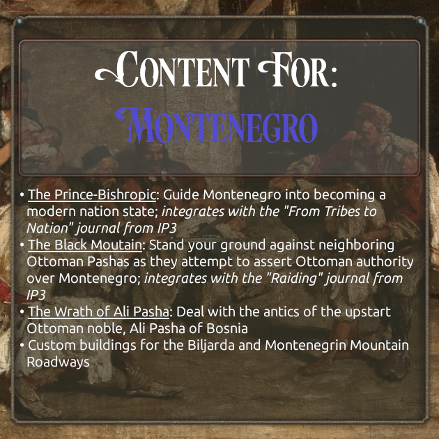

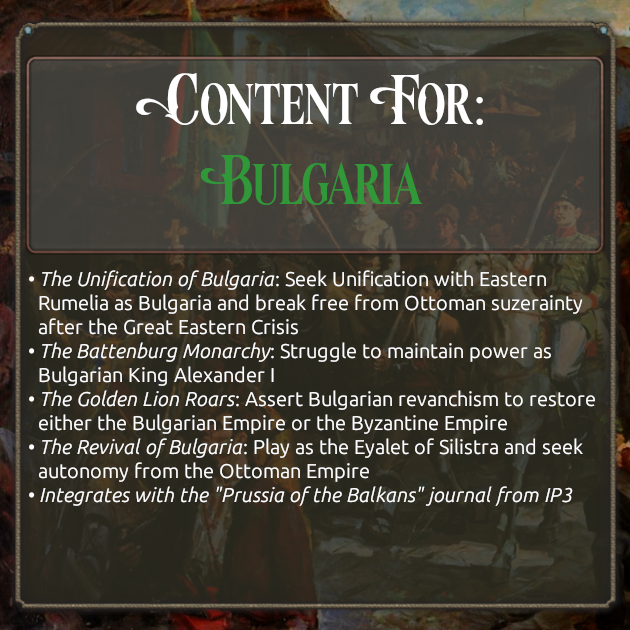
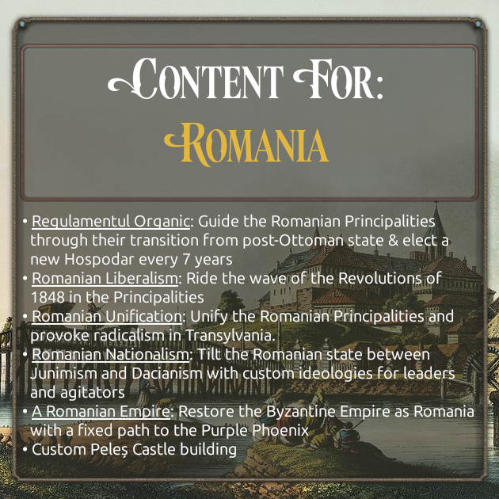
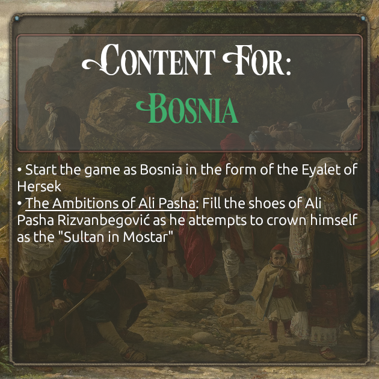
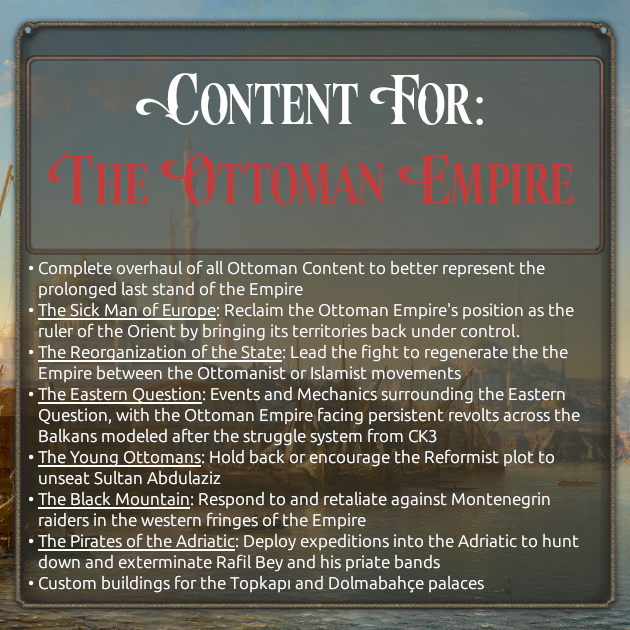
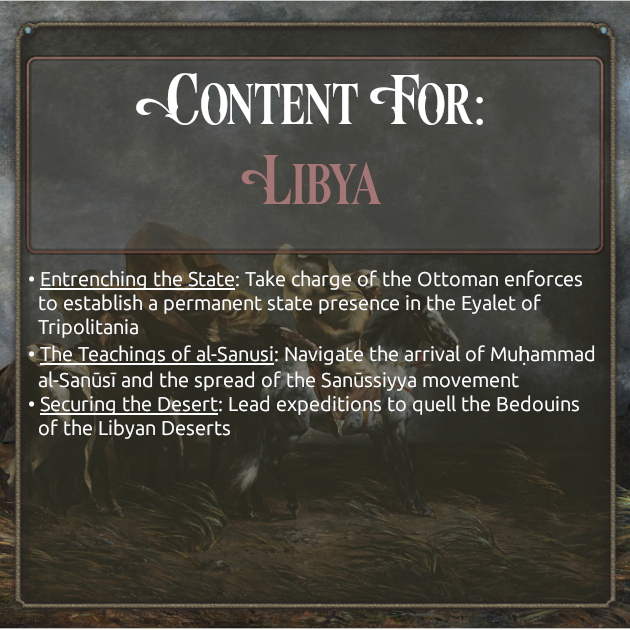
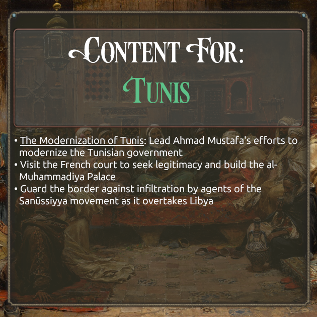
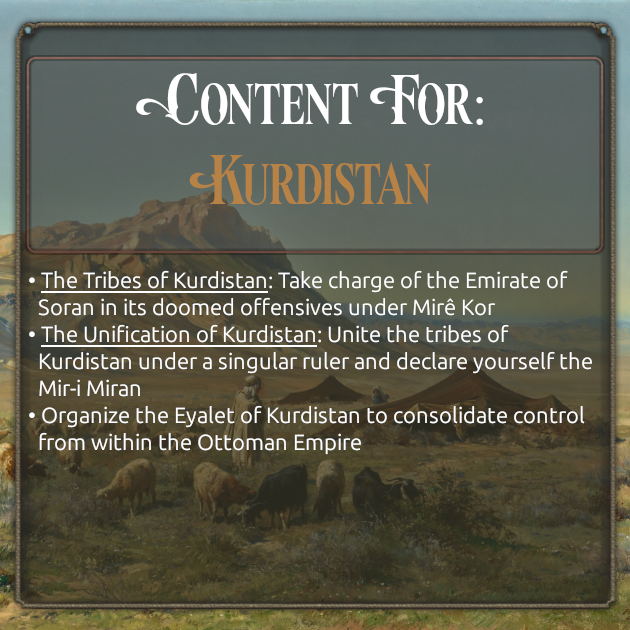
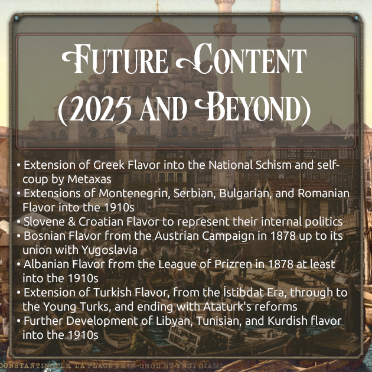

## Compatibility
** This mod is known to be compatible with:**
- Australia & New Zealand Flavor Pack
- Better Politics Mod (Place GBBF after BPM)
- Hail, Columbia!
- Morgenrote: Dawn of Flavor
- James's Korea Flavor Pack
- Community Outfits Mod

## Translations
- Chinese: https://steamcommunity.com/sharedfiles/filedetails/?id=2880069248
- German: https://steamcommunity.com/sharedfiles/filedetails/?id=3474052330
- Korean: https://steamcommunity.com/sharedfiles/filedetails/?id=3481804818

## Links
- GotB Mod Discord: https://discord.gg/nmcspFCg2x
- Github Repo: https://github.com/Alexedishi/Gates-of-the-Bosphorus
- Paradox Forums Post: https://forum.paradoxplaza.com/forum/threads/mod-greece-byzantium-the-balkans-flavor.1624682/

### IMPORTANT: This mod is dependent on the Community Mod Framework to work correctly!
**Community Mod Framework**: https://steamcommunity.com/sharedfiles/filedetails/?id=3385002128